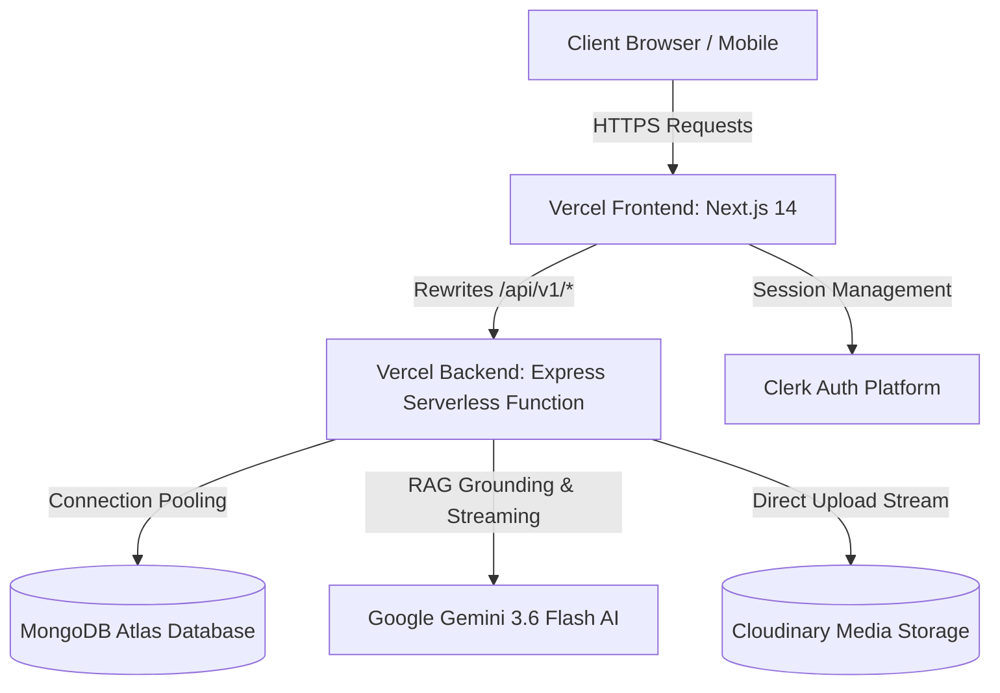

# SoloNomous Labs — Complete Vercel Production Deployment Guide

This comprehensive guide walks you through deploying both the **Frontend (Next.js 14)** and **Backend (Express Serverless API)** on Vercel with MongoDB Atlas, Google Gemini 3.6 Flash AI RAG, Clerk Authentication, and Cloudinary Media storage.

---

## 🏛️ Architecture Overview



### Why Deploy Frontend & Backend as Two Vercel Projects?
- **Separate Lifecycle**: Frontend UI updates rebuild in seconds without re-deploying backend lambdas.
- **Dedicated Environment Variables**: Prevents backend server secrets from being accidentally exposed in frontend bundles.
- **Zero CORS in Browser**: Next.js internally proxies `/api/v1/*` to the backend. The user's browser only ever communicates with your main domain.
- **Serverless Scaling**: Express routes execute as instant Vercel Serverless Functions with MongoDB connection pooling.

---

## 📋 Pre-Deployment Checklist

### 1. MongoDB Atlas Configuration (CRITICAL)
Vercel serverless functions execute on dynamic IP addresses. You **MUST** whitelist global access in MongoDB Atlas:
1. Log in to [MongoDB Atlas](https://cloud.mongodb.com/).
2. Under **Security**, click **Network Access**.
3. Click **Add IP Address** -> Select **ALLOW ACCESS FROM ANYWHERE** (`0.0.0.0/0`).
4. Click **Confirm**. *(If you don't do this, Vercel cannot reach your database).*
5. Under **Deployment** -> **Database**, click **Connect** -> **Drivers** -> Copy your connection string:
   ```
   mongodb+srv://<username>:<password>@cluster0.xxxxx.mongodb.net/solonomous_labs?retryWrites=true&w=majority
   ```

### 2. Google Gemini AI API Key
1. Go to [Google AI Studio](https://aistudio.google.com/).
2. Click **Get API key** and generate a key.
3. The project is pre-configured to use **Gemini 3.6 Flash** (`gemini-3.6-flash`).

### 3. Clerk Authentication Keys
1. Go to [dashboard.clerk.com](https://dashboard.clerk.com/).
2. Create an application (or select your existing one).
3. Under **API Keys**, copy the **Publishable key** (`pk_live_...` or `pk_test_...`) and **Secret key** (`sk_live_...` or `sk_test_...`).

### 4. Cloudinary Storage (Optional but Recommended)
1. Go to [Cloudinary Console](https://console.cloudinary.com/).
2. Copy your **Cloud Name**, **API Key**, and **API Secret**.

---

## 🚀 Deployment Process (Vercel Web Dashboard)

### STEP 1: Deploy the Backend API (`solonomous-backend`)

1. Push your repository to **GitHub**, **GitLab**, or **Bitbucket**.
2. Go to [vercel.com/new](https://vercel.com/new) and click **Import** on your repository.
3. In the setup form:
   - **Project Name**: `solonomous-backend` (or your preferred backend name)
   - **Framework Preset**: Select **Other**
   - **Root Directory**: Click **Edit**, select the `backend` folder, and click **Continue**.
4. Expand **Environment Variables** and add the following:

| Variable Name | Value / Description |
| :--- | :--- |
| `NODE_ENV` | `production` |
| `MONGODB_URI` | Your live MongoDB Atlas connection string |
| `JWT_SECRET` | A secure random 64-character secret key |
| `JWT_EXPIRES_IN` | `7d` |
| `CORS_ORIGIN` | `https://solonomous-labs.vercel.app` (or your planned frontend domain) |
| `GEMINI_API_KEY` | Your Google Gemini API Key |
| `GEMINI_MODEL` | `gemini-3.6-flash` |
| `CLERK_SECRET_KEY` | Your Clerk secret key |
| `CLERK_PUBLISHABLE_KEY` | Your Clerk publishable key |
| `CLOUDINARY_CLOUD_NAME` | *(Optional)* Your Cloudinary cloud name |
| `CLOUDINARY_API_KEY` | *(Optional)* Your Cloudinary API key |
| `CLOUDINARY_API_SECRET` | *(Optional)* Your Cloudinary API secret |

5. Click **Deploy**.
6. Once deployment finishes, copy your **Backend Domain**:
   - Example: `https://solonomous-backend.vercel.app`
7. **Verify the Backend**: Open `https://solonomous-backend.vercel.app/api/v1/health` in your browser. You should see:
   ```json
   {
     "status": "healthy",
     "service": "SoloNomous Labs API Engine",
     "version": "1.0.0"
   }
   ```

---

### STEP 2: Deploy the Frontend (`solonomous-frontend`)

1. Go back to [vercel.com/new](https://vercel.com/new) and click **Import** on the **same** repository.
2. In the setup form:
   - **Project Name**: `solonomous-labs` (or your preferred frontend name)
   - **Framework Preset**: Vercel will automatically detect **Next.js**
   - **Root Directory**: Click **Edit**, select the `frontend` folder, and click **Continue**.
3. Expand **Environment Variables** and add the following:

| Variable Name | Value / Description |
| :--- | :--- |
| `NEXT_PUBLIC_APP_URL` | `https://solonomous-labs.vercel.app` (your frontend Vercel URL) |
| `NEXT_PUBLIC_API_URL` | `https://solonomous-backend.vercel.app/api/v1` *(use your actual backend URL from Step 1)* |
| `INTERNAL_API_URL` | `https://solonomous-backend.vercel.app/api/v1` *(used by Next.js SSR)* |
| `NEXT_PUBLIC_CLERK_PUBLISHABLE_KEY` | Your Clerk publishable key |
| `CLERK_SECRET_KEY` | Your Clerk secret key |
| `NEXT_PUBLIC_CLERK_SIGN_IN_URL` | `/` |
| `NEXT_PUBLIC_CLERK_SIGN_UP_URL` | `/` |
| `NEXT_PUBLIC_CLERK_AFTER_SIGN_IN_URL` | `/` |
| `NEXT_PUBLIC_CLERK_AFTER_SIGN_UP_URL` | `/` |

4. Click **Deploy**.
5. Once deployment completes, visit your live URL: `https://solonomous-labs.vercel.app`!

---

## 💻 Alternative: Deploying via Vercel CLI (Terminal)

If you prefer using the command line:

```bash
# Install Vercel CLI globally
npm install -g vercel

# Login to your Vercel account
vercel login

# 1. Deploy the Backend
cd backend
vercel --prod

# 2. Deploy the Frontend
cd ../frontend
vercel --prod
```

During the CLI prompts:
- *Set up and deploy?* -> `y`
- *Which scope?* -> Select your account
- *Link to existing project?* -> `n` (first time)
- *Project name?* -> `solonomous-backend` (for backend) / `solonomous-labs` (for frontend)
- *Directory located?* -> `./`

---

## 🔍 Post-Deployment Verification

After both projects are deployed, verify every capability:

- [x] **Backend Health**: Visit `https://<your-backend>.vercel.app/api/v1/health` -> Expect `status: "healthy"`.
- [x] **Services API**: Visit `https://<your-backend>.vercel.app/api/v1/services` -> Expect 14 official SoloNomous Labs services populated automatically in your MongoDB Atlas database.
- [x] **Frontend Homepage**: Visit `https://<your-frontend>.vercel.app` -> All sections, hero typography, case studies, and services should render smoothly.
- [x] **Solo AI Chatbot (Gemini 3.6 Flash)**:
  - Click the **Ask Solo AI** chatbot at the bottom-right of the frontend.
  - Ask: *"What services does SoloNomous Labs offer?"*
  - Verify that the response streams in real-time powered by Gemini 3.6 Flash with RAG grounding and citations.
- [x] **Contact & Lead Generation Form**:
  - Visit `/contact` and submit a project inquiry.
  - Verify the success screen appears and the lead is stored in your MongoDB database.
- [x] **Admin Authentication**:
  - Visit `/admin`
  - Master Superadmin credentials:
    - **Email**: `nawaznoman7766@gmail.com`
    - **Password**: `@Noman668626`

---

## 🛠️ Troubleshooting & FAQs

### 1. Backend error: `MongooseServerSelectionError: Could not connect to any servers`
- **Cause**: MongoDB Atlas Network Access whitelist is blocking Vercel.
- **Fix**: Open MongoDB Atlas -> **Network Access** -> Add IP address `0.0.0.0/0` (Allow Access from Anywhere).

### 2. Frontend returns 404 on `/api/v1/*` requests
- **Cause**: `NEXT_PUBLIC_API_URL` or `INTERNAL_API_URL` is missing or misconfigured.
- **Fix**: In your Frontend project settings in Vercel, verify that `INTERNAL_API_URL` and `NEXT_PUBLIC_API_URL` are set to `https://<your-backend-url>.vercel.app/api/v1`. Then trigger a Redeploy.

### 3. Gemini returns quota or key error
- **Cause**: Invalid or expired `GEMINI_API_KEY`.
- **Fix**: Ensure your key from [Google AI Studio](https://aistudio.google.com/) is added to your backend project environment variables, and `GEMINI_MODEL` is set to `gemini-3.6-flash`.

### 4. Custom Domain Setup
To attach your custom domains (e.g. `solonomous.com` and `api.solonomous.com`):
1. In Vercel, open `solonomous-labs` -> **Settings** -> **Domains** -> Add `solonomous.com` and `www.solonomous.com`.
2. In Vercel, open `solonomous-backend` -> **Settings** -> **Domains** -> Add `api.solonomous.com`.
3. Update `NEXT_PUBLIC_API_URL` and `INTERNAL_API_URL` in the frontend project to `https://api.solonomous.com/api/v1`.
4. Update `CORS_ORIGIN` in the backend project to `https://solonomous.com`.
